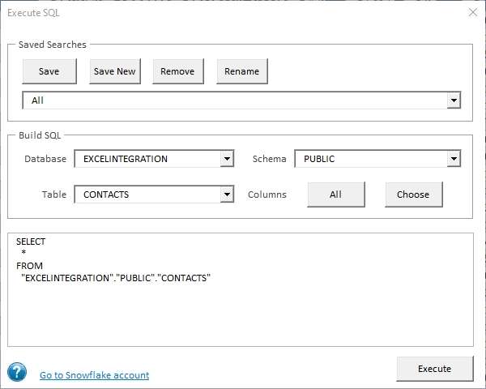
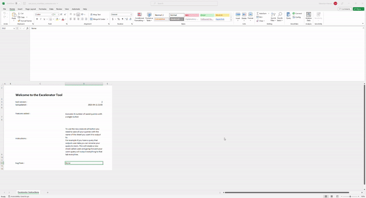

# Excelerator: Use Snowflake in Excel

Excelerator is an Excel Add-In to help you pull data from Snowflake into Excel and push new or updated data from Excel into Snowflake.
Excelerator is only compatible with the Windows operating system, not the MacOS.
View a [demo of Excelerator](https://youtu.be/csmS5V2ONr8) and see it [upload over 1 million rows (77MB)](https://www.youtube.com/watch?v=MLDnWLd1EHA). 

Example use-cases include:
* financial budgeting write-back,
* look-up table maintenance,
* pricing analysis,
* and more!

| :exclamation:        | Excelerator is not a supported product by Snowflake or any company. Excelerator will write data to the Snowflake database and should be used with great care. Use at your own risk.     |
|---------------|:------------------------|

## Get Started with Excelerator
Important: When following the instructions below, make sure to 'Unblock' the Addin after downloading. The details are in the link located in Step 2 below.

To get started, you'll need to:

* Install the Windows 64-bit or 32-bit ODBC driver for Snowflake
* Install the Add-In in Excel (below)
* [Connect your Snowflake account](#use-excelerator)
* [Query Snowflake](#execute-a-query) and optionally [write data back](#write-data-to-snowflake)

## Install the ODBC Driver
The Excel Add-In requires the ODBC driver. To download the driver, go to: https://sfc-repo.snowflakecomputing.com/odbc/index.html
Select the version of the ODBC driver, 64-bit or 32-bit, based on the local Excel installation. Make sure it matches or the Add-In will not work.
Once downloaded, install the driver. 

## Install Excelerator

### Step 1: Set Required Privileges

Below are the privileges required for each capability.

To **query** data:
| **Object** | **Privilege**        |
|------------|----------------------|
| Database   | USAGE                |
| Schema     | USAGE|
| Table      | SELECT               |

\*Stage can be provided in the login instead

To **upload** data requires everything in query, plus:

| **Object** | **Privilege**            |
|------------|--------------------------|
| Schema     | CREATE TABLE,CREATE STAGE|
| Table      | INSERT, UPDATE, TRUNCATE |

To **rollback** data requires the schema privileges from upload, plus:

| **Object** | **Privilege** |
|------------|---------------|
| Table      | Ownership     |
  

Optional
The following script will create a new role with the proper privileges, except the table level privileges: `SnowflakeExcelAdd-In_Create_Role.sql` 
You’ll have to update the script before executing it with the information specific to your environment. In the script, you will be providing the role of the user that will be using this Add-In. The script will assign the new to the existing role, which will inherit all the privileges defined in the script.

### Step 2 – Install Excel Add-in

There are 2 versions of the Excel Add-in, one for only reading data from Snowflake and one for reading and writing data to snowflake. The Excel Add-ins are Excel files with an extension of ".xlam". The .xlam file for the read-only version is called "SnowflakeExcelAdd-InReadOnly.xlam". The full read-write version is called "SnowflakeExcelAdd-In.xlam". These files are both stored in the repository. In order to install these add-ins, follow the instructions here: https://exceloffthegrid.com/install-uninstall-excel-add/. 

The Excelerator is now available on the Home tab of the Ribbon.

## Use Excelerator

With Excelerator installed, now you need to connect it to Snowflake. 

First, confirm you can find the appropriate buttons within the "Home" tab.

### Connection Parameters

Click the `connect` button and enter your Snowflake connection information.  There are two security types standard: login/password and SSO.  We recommend using SSO for more secure authentication.

The user's default role and warehouse will be used. If the user does not have a default warehouse, they will be prompted to enter one.
Both the role and warehouse can be changed by clicking on the 'Config' menu item in the Excel ribbon.

### Overview

Now we'll walk you through each section of the Add-In. You can work with data sourced from other data sources within Excel (such as files) or you can pull data from Snowflake into Excel.  You can manipulate the data using VBA scripts and vlookups, but be sure to write that final data back to Snowflake! The Add-In handles both reading and writing scenarios.

### Execute a Query
Pull data into Excel by selecting the “Query" button. 
A search dialog will open that allows you to select a database, schema and table in order to download data. Once you select a table you can then choose which columns you would like to reutrn from the selected table. You can select all the columns by clicking the "All" button, or select a subset of columns by clicking the "Choose" button. Once selected, a SQL statement is created and entered in the bottom text area. This SQL statement can be manually updated.
Click the "Execute" button to execute the query in Snowflake and pull down the result set.

You'll get results that look similar to this:

Repeat as-needed to gather data from Snowflake into your Excel sheet.

### *New* Execute all Queries
Pull data into Excel by selecting the “Query" button. 
A search dialog will open that allows you to select a database, schema and table in order to download data. You will need to save all your queries and rename them to what you want your sheet to be called  (For example a query to pull users data could be stored under Users). Going forward that tab will become the home for your query and every time you refresh it will be saved in that tab.

**Note: Make sure your names are unique if not the last query run with a specific duplicate name will overwrite the previous run** 

Click the "Execute All" button to execute the query in Snowflake and pull down the result set.

You'll get results that look similar to this:

)

Repeat as-needed to gather data from Snowflake into your Excel sheet.

### Write Data to Snowflake

To write data to Snowflake, click the "Upload" button in the ribbon.

#### Select Upload Table
In the top section, choose the database, schema and table to upload the data to.

##### Basic Upload section
There are 3 basic ways to upload data into a table:
* Update existing rows & Append new rows 
* Append data - This will insert all the data into the table.
* Replace all data in the table with the data from the spreadsheet - All the data will be deleted from the table and then the new data will be inserted.

When selecting the first option, you will have to define the columns that represent the table key. The key defines how each row is unique, and is used to update existing rows. This can be done by entering the column position, for example: A,B,C.  In this case the first 3 columns in the excel sheet and target table will be the key.

With any of the above options, if a column exists in the spreadsheet, but does not exist in the table, it will be added automatically to the Snowflake table. The data type can be specified by clicking the "Define Data Types" button in the ribbon. If you prefer to have Snowflake determine the data types, select the "Auto-generate data types" in the "Advance Options" section below.

#### "Advanced Options" section 
This section allows more options:
* Create a new table - This will create a new table with the columns specified in the first row.
* Recreate and existing table - This will drop the table and recreate the table with the columns specified in the first row.

### Specifying Data Types 
For any new columns, the data type needs to be manually specified by clicking the "Define Data Types" button in the ribbon. A new row will be created in the first line of the spreadsheet containing a drop down of the Snowflake supported data types. Choose the appropriate data types for each column.

| :wrench: Limitations|
|:---------------------------|
| Timestamps don’t handle anything less than seconds. To get around this, manually cast the time to a varchar in the SQL. |

#*This repo was forked from  https://github.com/Snowflake-Labs/Excelerator.git to add multiquery functionality which did not exist*#
